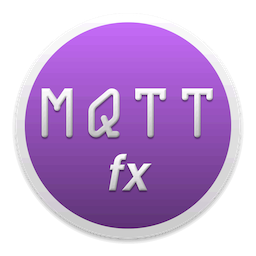

# Default MQTT.fx Payload Decoders



The default preset of [MQTT.fx](http://mqttfx.org) message payload decoder
implementations, based on [addon-commons](https://github.com/Jerady/addon-commons).

A *payload decoder* takes the raw bytes of an MQTT message and converts them into
a human-readable `String` for display in MQTT.fx. Decoders are plugins discovered
at runtime through Java's `ServiceLoader` mechanism, so the set of available
decoders can be extended without changing MQTT.fx itself.

## Table of Contents

- [Available Decoders](#available-decoders)
- [Sparkplug Decoders](#sparkplug-decoders)
- [How It Works](#how-it-works)
- [Building from Source](#building-from-source)
- [Running the Tests](#running-the-tests)
- [Writing Your Own Decoder](#writing-your-own-decoder)
- [Dependencies](#dependencies)
- [License](#license)

## Available Decoders

All decoders live in the package `de.jensd.addon.decoder.preset`.

| Name | Classname | Content Type | Purpose |
| :--- | :--- | :--- | :--- |
| Plain Text Decoder | `PlainTextDecoder` | `text/plain` | Decodes the payload data into plain text. |
| Base64 Decoder | `Base64Decoder` | `text/base64` | Encodes the payload data into a Base64 string. |
| JSON Pretty Format Decoder | `JsonPrettyFormatDecoder` | `application/json` | Decodes JSON payload data into a readable, indented format. |
| Hex Format Decoder | `HexFormatDecoder` | `application/hex` | Decodes the payload data into a hex formatted string. |
| Hex Pretty Format Decoder | `HexPrettyFormatDecoder` | `application/hex` | Decodes the payload data into a readable, formatted hex string. |
| Binary Format Decoder | `BinaryDecoder` | `application/binary` | Decodes the payload data into a binary string. |
| MsgPack Decoder | `MsgPackDecoder` | `text/plain` | Decodes [MessagePack](https://msgpack.org) payload data into plain text. |
| Sparkplug Decoder (Cirrus Link) | `SparkplugDecoder` | `application/sparkplug` | Decodes binary Sparkplug payload data into a JSON representation. |
| Sparkplug Pretty Format Decoder (Cirrus Link) | `SparkplugPrettyFormatDecoder` | `application/sparkplug` | Decodes binary Sparkplug payload data into a formatted JSON representation. |
| Sparkplug Decoder (Eclipse Tahu) | `SparkplugTahuDecoder` | `application/sparkplug` | Decodes binary Sparkplug payload data into a JSON representation. |
| Sparkplug Pretty Format Decoder (Eclipse Tahu) | `SparkplugTahuPrettyFormatDecoder` | `application/sparkplug` | Decodes binary Sparkplug payload data into a formatted JSON representation. |

## Sparkplug Decoders

Sparkplug is a specification for MQTT-enabled devices and applications to send and
receive messages in a stateful way. The payload is transmitted as a binary
(Protobuf-encoded) format, which these decoders translate into JSON.

Two implementations are provided:

- **Cirrus Link** (`SparkplugDecoder`, `SparkplugPrettyFormatDecoder`) — the
  original decoders. Many thanks to Wes Johnson from
  [Cirrus Link](https://www.cirrus-link.com) for the contribution!
- **Eclipse Tahu** (`SparkplugTahuDecoder`, `SparkplugTahuPrettyFormatDecoder`) —
  newer decoders based on the [Eclipse Tahu](https://github.com/eclipse/tahu)
  project (`org.eclipse.tahu:tahu-core`).

You can find more information about Sparkplug
[here](https://github.com/eclipse/tahu).

## How It Works

Each decoder implements the `de.jensd.addon.decoder.PayloadDecoder` interface,
which extends the `AddOn` contract from addon-commons. The key method is:

```java
String decode(byte[] payload);
```

Alongside `decode`, every decoder exposes metadata: `id`, `name`, `version`,
`description` and `contentType` (a MIME type from the `ContentType` enum).

In practice, decoders extend the `AbstractPayloadDecoder` base class. It backs all
metadata fields with JavaFX `StringProperty` objects (so MQTT.fx can bind to them)
and provides `compareTo`, `equals` and `hashCode`. A concrete decoder only needs to
set its metadata in the constructor and implement `decode`.

Decoders are registered for runtime discovery via the Java `ServiceLoader` SPI file:

```
src/main/resources/META-INF/services/de.jensd.addon.decoder.PayloadDecoder
```

Each line in that file is the fully-qualified class name of a decoder. MQTT.fx (and
the test suite) load decoders by reading this file, so a decoder that is not listed
there will not be discovered.

## Building from Source

The project uses the Gradle wrapper, so no local Gradle installation is required.

```bash
./gradlew build              # compile, run tests and build the JAR
./gradlew clean build        # clean rebuild
```

To install the artifact into your local Maven repository:

```bash
./gradlew publishToMavenLocal
```

## Running the Tests

The test suite uses JUnit 5 (Jupiter):

```bash
./gradlew test                                         # run all tests
./gradlew test --tests de.jensd.addon.BinaryDecoderTest   # single test class
```

## Writing Your Own Decoder

1. Create a class in `de.jensd.addon.decoder.preset` that extends
   `AbstractPayloadDecoder`.
2. In the constructor, set `idProperty`, `nameProperty`, `versionProperty`,
   `descriptionProperty` and `contentTypeProperty`.
3. Implement `decode(byte[] payload)` to return the readable `String`.
4. **Add the fully-qualified class name** to
   `src/main/resources/META-INF/services/de.jensd.addon.decoder.PayloadDecoder` so
   it is picked up by `ServiceLoader`.

Minimal example:

```java
public class MyDecoder extends AbstractPayloadDecoder {

    public MyDecoder() {
        idProperty().set("my_decoder");
        nameProperty().set("My Decoder");
        versionProperty().set("1.0.0");
        descriptionProperty().set("Decodes the payload my way.");
        contentTypeProperty().set(ContentType.PLAIN_TEXT.getMimeType());
    }

    @Override
    public String decode(byte[] payload) {
        return new String(payload);
    }
}
```

## Dependencies

- [addon-commons](https://github.com/Jerady/addon-commons) — the add-on/plugin SPI
- [Eclipse Tahu](https://github.com/eclipse/tahu) (`tahu-core`) — Sparkplug B support
- [Jackson](https://github.com/FasterXML/jackson) — JSON processing
- [Apache Commons Codec](https://commons.apache.org/proper/commons-codec/) — Base64/Hex
- [MessagePack for Java](https://github.com/msgpack/msgpack-java) — MsgPack support
- [OpenJFX](https://openjfx.io) — JavaFX properties used by the add-on metadata

## License

Licensed under the [Apache License, Version 2.0](LICENSE).
